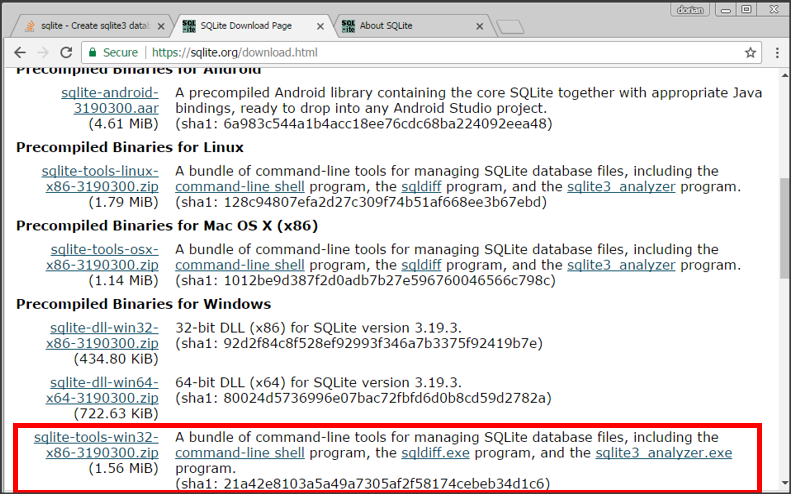

# Setting up a Serverless Database on a Windows machine  

This is a bit of a 'infrastructure' post. Helping develop a working environment for future projects.  
I prefer storing data in a database vs txt files, but that's me.  

### Educators  

My primary source for this is SQLite's quickstart page [website](https://sqlite.org/quickstart.html).  

### Tool  
I briefly considered three databases for this:  
1. Oracle Lite
    * Looks like this requires you to setup a mini-server function on your PC. Sounds like a pain  
2. Microsoft Access  
    * This is my bias. When it was demo-ed to me 10ish years back. It felt like it was a toy. SQL query tool and database in one. (Decade old memories can be hazy. Sorry if that's inaccurate.)  
3. SQLite  
    * Only option that my google-fu skills found that fit the bill for what I'm looking for.  
        * A real, queryable database
        * easy to setup  
        * no server  
        * doesn't feel like a toy

## 1) Getting Started  
Head over to [SQLite](https://sqlite.org/download.html)  

You'll want a sqlite-tools..zip file.  



I wish there were a tools file for 64 bit. But at the time there's only one for 32 bit.  
I have no idea what the 64 bit DLL is. I tried opening it and it was gibberish  

## 2) Choose Your Directory  
Open the zip file, and move its contents to wherever you want to house this database.  
__enter pic here__  
* In this example, I'm storing it in /database_temp/sqlite32/  
Go ahead and run sqlite3.exe  

## 3) Create Your Database  
A Command Prompt/DOS window should open up and will run a little code.  
You're now ready to create your database.  
__enter pic here__  
To create your database, type: ```.open [database name].db ```  
* In theory, you don't need this tools exe.  
You could open the command prompt, navigate to this folder, then type ```sqlite3```.  
But I'm not sure which file that runs off of, or if that only works because I've already run this .exe  
  
You should now see a file named __[database].db__ appear in the directory.  
In my case, I named it __example1__  
__enter pic here__   

## 4) Connect to the Database  
You can now start typing SQL directly into the DOS window.  
__enter pic here__   
Isn't this fun???  
How about we setup an ODBC connection, so we can use sane tools instead?  
* ODBC is how many/most tools connect to a standard database.
* Basic methodology is:  
    1. Download the driver for that type of database
    2. Fill out connection information such as 'where is the database'  

### Setting up the ODBC  

### 1) Download and install the sqllite odbc drivers.  
I downloaded them from [ch-werner.de](http://www.ch-werner.de/sqliteodbc/)

### 2) Get to the ODBC Manager  
You have two ODBC managers. One for 32 bit, one for 64 bit.  
In the start menu search for __ODBC Data Sources__ to open the appropriate manager.  

### 3) Configure the ODBC Manager  
Open the ODBC Manager and switch to the __System DSN__ tab  
* You could do this in the __User DSN__ tab if you don't have admin access. But by habit I use __System DSN__  

__enter pic here__   
Time to add a new connection...  
__enter pic here__   
Fill this out as appropriate for the database you just created.  
* Data Source Name: The name you want to call this connection  
* Database Name: The path and name of the database you just created.  

You can now connect using your ODBC query tool of choice, including R or Python.  

### Final Notes  
* There's probably a smoother way to do this. And clearly there's a way to make a 64 bit version of the database.  
* But this is the level of knowledge I currently have, and it's enough for my minor needs


